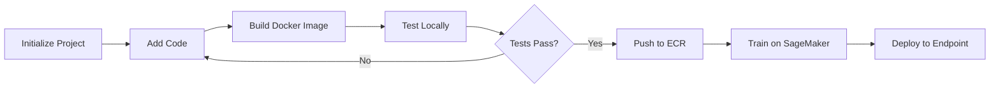

# User Guide Overview

easy_sm simplifies AWS SageMaker workflows by providing a unified CLI for local prototyping and cloud deployment.

## Key Concepts

### Local Development

Develop and test machine learning models locally using Docker containers that mimic the SageMaker environment. This enables:

- Fast iteration without cloud costs
- Debugging with familiar local tools
- Offline development without AWS connectivity

Learn more: [Local Development](local-development.md)

### Cloud Deployment

Deploy trained models to AWS SageMaker with minimal configuration. easy_sm handles:

- Docker image building and ECR push
- SageMaker training job creation
- Endpoint deployment (provisioned and serverless)
- Batch transform jobs
- Processing jobs

Learn more: [Cloud Deployment](cloud-deployment.md)

### Context Auto-Detection

easy_sm minimizes repetitive flags by auto-detecting:

- **App name**: From `*.json` config file in current directory
- **IAM role**: From `SAGEMAKER_ROLE` environment variable
- **AWS credentials**: From AWS CLI configuration

Override with `-a/--app-name` and `-r/--iam-role-arn` flags when needed.

### Unix Philosophy

Commands follow Unix principles:

- **Composable**: Output clean data suitable for piping
- **Single purpose**: Each command does one thing well
- **Pipe-friendly**: Minimal verbose output, data goes to stdout

Learn more: [Piped Workflows](piped-workflows.md)

## Workflow Patterns

### Typical Development Flow



1. **Initialize**: `easy_sm init`
2. **Develop**: Write training/serving code
3. **Build**: `easy_sm build`
4. **Test**: `easy_sm local train` / `easy_sm local deploy`
5. **Deploy**: `easy_sm push` → `easy_sm train` → `easy_sm deploy`

### Rapid Prototyping

For quick experiments:

```bash
# Edit code
vim my-app/easy_sm_base/training/training.py

# Rebuild and test
easy_sm build && easy_sm local train
```

No need to push to cloud for each code change.

### Production Deployment

For production pipelines, configure a versioned tag in your config:

```json
{
    "image_name": "my-ml-app",
    "docker_tag": "v1.0.0"
}
```

Then run:

```bash
# Build versioned image
easy_sm build

# Push to ECR
easy_sm push

# Train with tagged image
easy_sm train -n prod-job-v1.0.0 \
  -e ml.m5.xlarge -i s3://... -o s3://...

# Deploy latest model
easy_sm deploy -n prod-endpoint -e ml.m5.xlarge \
  -m $(easy_sm get-model-artifacts -j prod-job-v1.0.0)
```

## Command Categories

### Initialization

- `init`: Create new easy_sm projects

### Local Operations

- `local train`: Train models locally
- `local deploy`: Deploy models locally (port 8080)
- `local process`: Run processing jobs locally
- `local stop`: Stop local deployments

### Build & Push

- `build`: Build Docker images
- `push`: Push images to AWS ECR
- `update-scripts`: Update shell scripts with security fixes

### Cloud Operations

- `train`: Train models on SageMaker
- `deploy`: Deploy to provisioned endpoint
- `deploy-serverless`: Deploy to serverless endpoint
- `batch-transform`: Run batch predictions
- `process`: Run processing jobs on SageMaker

### Management

- `list-endpoints`: List all SageMaker endpoints
- `list-training-jobs`: List recent training jobs
- `get-model-artifacts`: Get S3 model path from training job
- `delete-endpoint`: Delete an endpoint
- `upload-data`: Upload data to S3

See the [Command Reference](../commands/index.md) for detailed documentation.

## Prerequisites

Before using easy_sm, ensure you have:

### Local Requirements

- Python >=3.13
- Docker installed and running
- Basic familiarity with command line

### AWS Requirements

- AWS account with access to SageMaker
- AWS CLI configured with credentials
- SageMaker execution IAM role
- S3 bucket for training data and models
- ECR repository for Docker images (created automatically)

See [AWS Setup](aws-setup.md) for detailed configuration instructions.

## Project Structure

easy_sm projects follow a standard structure:

```
my-project/
├── my-app.json                      # Configuration
├── requirements.txt                 # Python dependencies
└── my-app/                          # Module directory
    └── easy_sm_base/
        ├── Dockerfile
        ├── training/
        │   ├── train                # SageMaker training entry point
        │   └── training.py          # Your training logic
        ├── prediction/
        │   └── serve                # Your serving/inference logic
        ├── processing/              # Processing scripts
        └── local_test/
            └── test_dir/            # Test data for local development
```

### Key Directories

**training/**: Contains training code and entry point. SageMaker calls `training/train` when starting training jobs.

**prediction/**: Contains serving code. SageMaker calls `prediction/serve` for inference endpoints.

**processing/**: Custom processing scripts for SageMaker Processing jobs.

**local_test/test_dir/**: Sample data for local testing. Structure mirrors SageMaker directories.

## Configuration Management

Projects are configured via JSON files:

```json
{
    "image_name": "my-ml-app",
    "aws_profile": "dev",
    "aws_region": "eu-west-1",
    "python_version": "3.13",
    "easy_sm_module_dir": "my-ml-app",
    "requirements_dir": "requirements.txt"
}
```

Learn more: [Configuration](../getting-started/configuration.md)

## Next Steps

- **New users**: Start with [Local Development](local-development.md)
- **Cloud deployment**: See [Cloud Deployment](cloud-deployment.md)
- **AWS setup needed**: Follow [AWS Setup](aws-setup.md)
- **Advanced usage**: Explore [Piped Workflows](piped-workflows.md)
